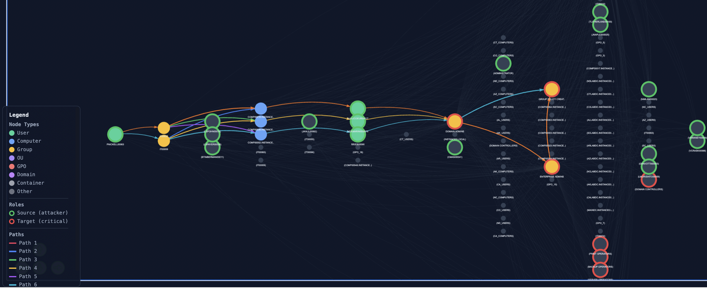
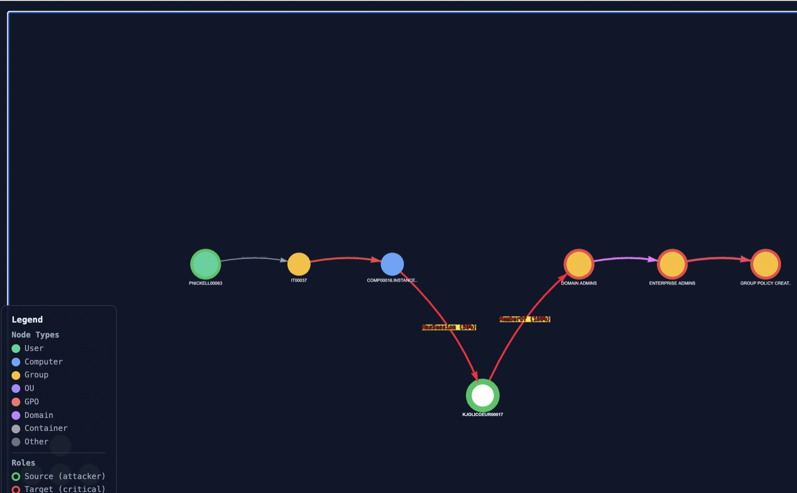
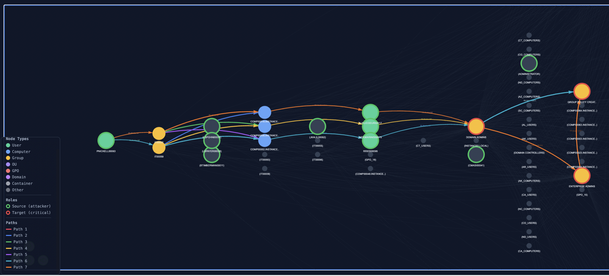
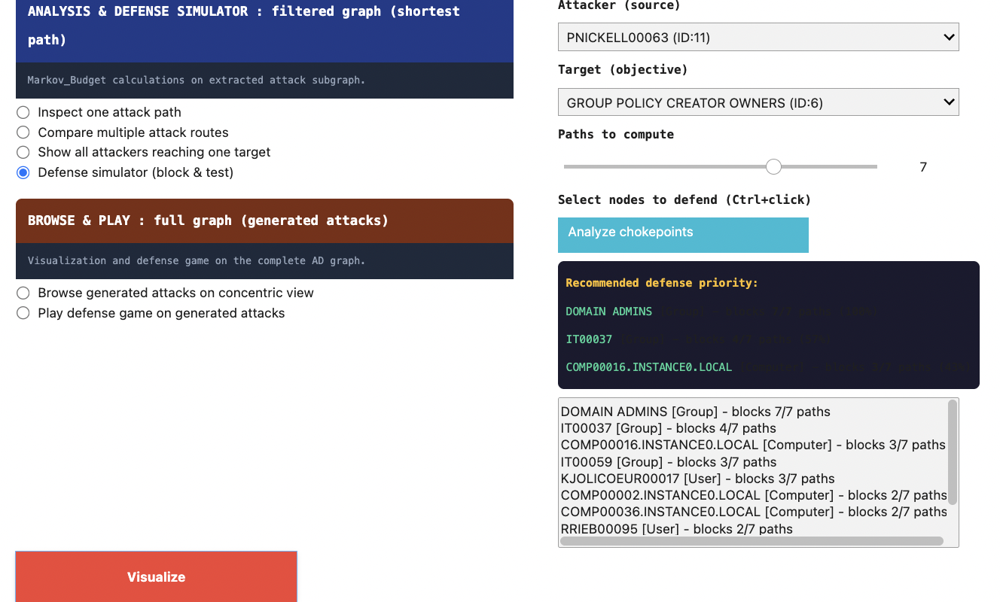
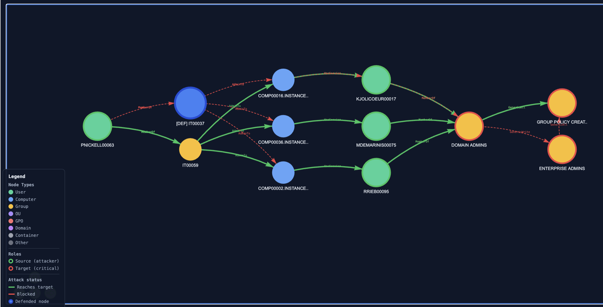

## Analysis modes

> *This tab covers the four modes that operate on the filtered subgraph. All four modes share three input widgets : Attacker, Target, and Paths-to-compute (k) and produce visualizations that emphasize the topological structure of attack paths rather than the structural context of the full AD environment.*

### Layout convention

Analysis visualizations use a **column layout**, not a concentric layout. Source nodes appear in the leftmost column, target nodes in the rightmost column, intermediate nodes in columns sorted by their distance from the source. This convention makes the direction of attack progression explicit (left-to-right) and makes path comparisons visually unambiguous.

### Mode 1 : Inspect one attack path

#### Purpose
Examine a single shortest path between a chosen attacker and a chosen target. Useful for forensic walk-throughs ("how exactly would this attacker reach this target?") and for explaining a path step-by-step to a non-technical stakeholder.

#### How to use
1. Select an Attacker from the dropdown. The list shows declared attacker sources from the filtered subgraph, formatted as `<name> (ID:<index>)`.

2. Select a Target. Same format; the list shows declared high-value targets.

3. Set Paths-to-compute (k) to the number of shortest paths to enumerate (1–10).

4. Set "Which path" to the index (0 to k-1) of the path you want to render.

5. Click Visualize.

The path is drawn in colour (one colour from the path palette); all other nodes and edges of the filtered subgraph are dimmed for context. Each edge is labelled with its AD relation type (e.g. `MemberOf`, `AdminTo`, `GenericAll`).

#### What to observe
The relation type on each edge tells you the privilege required at each hop. A path consisting mostly of `MemberOf` edges is low-privilege traversal (group membership chain); a path containing `GenericAll` or `WriteDacl` hops is high-privilege exploitation. The path's overall feasibility is the product of edge probabilities  paths with many `HasSession` or `AllowedToDelegate` edges are less reliable for the attacker.

### Mode 2 : Compare multiple attack routes

#### Purpose
Visualize the *k* shortest paths between a chosen attacker and a chosen target simultaneously, each in a distinct colour. Useful for identifying paths that share intermediate nodes (chokepoints) and paths that diverge.

#### How to use
1. Same Attacker / Target selection as Mode 1.

2. Set k to the number of paths to overlay (1–10).

3. Optionally enable "Show neighbors" to dim non-path nodes.

4. Click Visualize.

#### What to observe
Look for nodes through which multiple coloured paths pass these are candidate chokepoints. A single defended node breaking many coloured paths simultaneously is what the Defense simulator (Mode 4) will rank highly. This mode is the visual prerequisite for understanding why a chokepoint matters.

### Mode 3 : Show all attackers reaching one target

#### Purpose
Pivot the analysis: fix one high-value target and visualize how every declared attacker source can reach it. Useful for target-centric defense planning ("if this is the asset I want to protect, what is its full attack surface?").

#### How to use
1. Select a Target (the Attacker dropdown is hidden in this mode).

2. Set Paths-to-compute (k) interpreted here as **paths per source**.

3. Optionally enable "Show neighbors".

4. Click Visualize.

For each source, the *k* shortest paths to the chosen target are computed and rendered. Paths from different sources are shown together; the visualization scales to the worst case (number of sources × k).

#### What to observe
A single target with many short paths from many sources is more exposed than one with few long paths from few sources. Nodes that appear on paths from multiple sources are stronger chokepoints than nodes on paths from a single source, defending them protects against a wider class of adversaries.

### Mode 4 : Defense simulator

#### Purpose
Test arbitrary defense allocations under the framework's random-walk model. Choose a set of nodes to defend; the visualization renders the *k* shortest paths and reports, per attack family, how many paths in the precomputed `attacks_dict` are blocked by the chosen allocation.

#### How to use
1. Select an Attacker, a Target, and a value of k.

2. Click "Analyze chokepoints". This calls `vp.analyze_chokepoints` and populates the "Select nodes to defend" list with the top candidates, ranked by the number of paths each node intercepts among the *k* shortest. The "Recommended defense priority" panel shows the top three.

3. Select one or more nodes from the list (Ctrl+click or Cmd+click for multi-selection).

4. Click Visualize.

#### What to observe
Defended nodes are marked with a coloured ring; paths that pass through them are reported as blocked. The bottom of the visualization summarizes, per family: `<family>: N/M paths blocked (XX.X%)`. The percentage is the proportion of generated attacks of that family that traverse at least one of the defended nodes.

#### Connection to the Markov-Budget output
The chokepoint ranking surfaced by "Analyze chokepoints" is **structural**: it counts path intersections among the *k* shortest paths, ignoring the probability-weighted random-walk model. The Markov-Budget optimization, by contrast, returns a real-valued `J_star` allocation under the probabilistic model. The two rankings often agree on the top nodes but can diverge on lower-ranked candidates. The Defense simulator lets the operator inspect both the chokepoint count is shown directly in the suggestion list; the Monte Carlo defense weight is shown in each node's tooltip.
