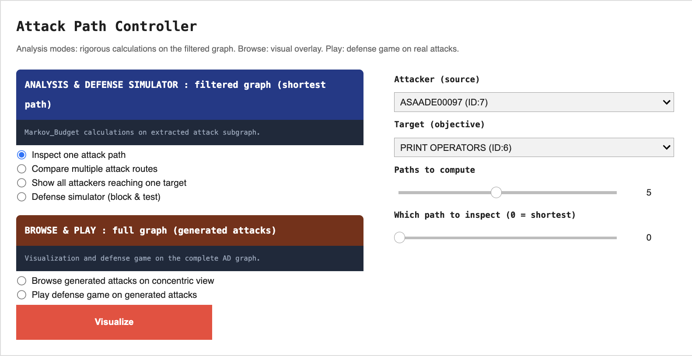
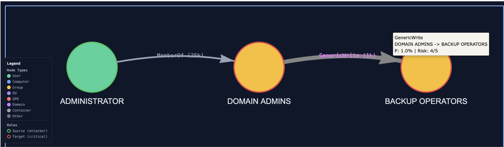
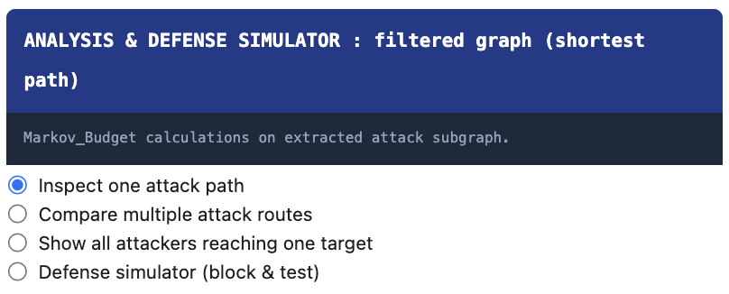
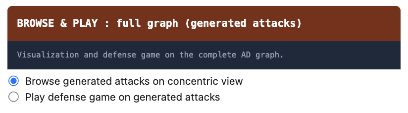
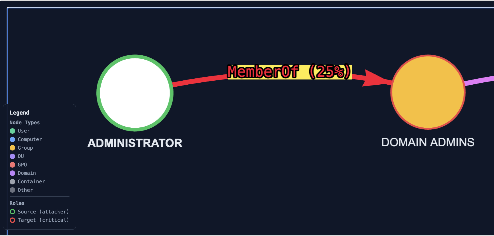

# Attack Path Controller : Documentation

> *This page documents the Attack Path Controller, a visualization and decision-support module for the Random Walk Interdiction Problem on Active Directory graphs. The Explorer transforms the analytical outputs of the Markov-Budget framework into interactive, inspectable artifacts: attack-path renderings, chokepoint rankings, and a defense game grounded in generated attacks.*

---

## Concepts and prerequisites

### What the Attack Path Explorer is

The Attack Path Explorer is the interactive layer that sits on top of the analytical pipeline. Where the upstream stages produce numerical artifacts (a generated AD graph, a probability-annotated graph, a filtered attack subgraph with optimal defense weights, four sets of attack scenarios), the Explorer turns those artifacts into **actionable visual decisions**: which paths matter, which nodes block the most attacks, how a chosen defense allocation performs against a real attack set.

The Explorer does not regenerate any data. It loads the JSON files produced upstream and renders them through one ipywidgets controller exposing seven modes. The same `attacks_dict` is used across all modes — what you see in the Browse view is bit-for-bit the same attacks the Defense simulator counts as blocked or open.

### Why the framework needs an interactive layer

The Markov-Budget framework solves a constrained optimization problem: given a budget B and an adversary modelled as a random walk on a probability-annotated AD graph, find the defense allocation that minimizes the probability of the adversary reaching a high-value target. The output of the optimization is a per-node defense weight vector `J_star` — a real-valued allocation, not a binary defended/undefended decision.

This output, taken alone, is insufficient for a security operator. Three questions remain unanswered:

1. **Which nodes drive the score?** A defense weight of 0.42 on node X is meaningless without seeing where X sits in the attack topology and how many paths it intercepts.

2. **How does the optimal solution compare to other plausible allocations?** The operator may have constraints that the optimization does not encode (operational cost, political feasibility, tooling availability). They need to test alternatives.

3. **Does the optimal solution behave well against attacks that do not follow the random-walk model?** The framework's adversary is a mathematical idealization. Real attackers (LateralAdminChain, ShadowAdmin, KerberosAdjusted, OpportunistLouise) follow specific heuristics. An allocation optimal under the random-walk model may be suboptimal against any specific heuristic.

The Attack Path Explorer answers these three questions through, respectively: the Analysis modes (which expose the *k* shortest paths and rank chokepoints), the Defense simulator (which lets the operator test arbitrary allocations under the framework's model), and the Play mode (which scores any allocation against the four heuristic attack families).

### Prerequisites the user needs to understand

The Explorer assumes the reader is comfortable with three concepts. Each is well-documented in the framework literature, but a working summary is given here for self-containment.

#### Random walk on a probability-annotated graph

Each edge in the AD graph carries a success probability `prob ∈ (0, 1]`, reflecting how likely an adversary is to traverse that AD relation. `GenericAll` (full control) is set to 1.0; `HasSession` (relies on session validity) to 0.7. Each node carries a target-criticality probability. An adversary located at node *u* moves to a neighbour *v* with probability proportional to `prob(u, v)`; the walk terminates when the adversary either reaches a target or fails a traversal. The probability of compromise is the probability that a random walk starting at any source node reaches any high-value target.

This is the model under which the Markov-Budget optimization runs. The Explorer's filtered subgraph (`graph_0_structured.json`) is built by retaining only the nodes and edges that contribute non-negligibly to this probability.

#### Monte Carlo Dirichlet defense allocation

The optimal allocation under a budget is found by sampling. The procedure draws a large number of candidate allocations (typically 1000) from a Dirichlet distribution over the nodes of the filtered subgraph, evaluates each by computing the resulting compromise probability under the random-walk model, and keeps the empirical minimum. The Dirichlet prior ensures the samples respect the budget constraint (the per-node weights sum to B). The Monte Carlo procedure is what justifies treating `J_star` as a near-optimum even though no closed form exists for the minimization.

The Explorer surfaces this allocation in two places: the per-node tooltip (each node's optimal defense weight is displayed when hovered) and the "Recommended defense priority" panel of the controller's Defense simulator (the top three nodes by weight are pre-suggested as the starting allocation).

#### Filtered subgraph vs complete graph

The full AD graph generated by ADSimulator typically contains 400+ nodes. Most of them play no role in any attack path: pure administrative containers, isolated branches, OU hierarchies disconnected from any source/target pair. The filtering step (executed automatically as part of graph generation) extracts the induced subgraph on nodes that lie on at least one path between a viable attacker source and a high-value target. This filtered subgraph (~100 nodes for a typical scenario) is the object the Markov-Budget framework operates on.

The Explorer exposes both views: Analysis modes operate on the filtered subgraph (because the framework's outputs are only defined there); Browse and Play modes operate on the complete graph (because the operator's mental model includes the full AD environment).

### How the controller separates the two views

The controller widget contains two mutually exclusive groups:

- **Analysis** (blue banner)  operates on the filtered subgraph. Four modes: inspect a single attack path, compare *k* shortest paths, show all attackers reaching one target, defense simulator under the framework's model.

- **Browse & Play** (red-orange banner) operates on the complete graph. Three modes: browse a single generated attack, browse multiple attacks overlaid, defense game on generated attacks.

Selecting any mode in one group automatically deselects the other. Only the widgets relevant to the active mode are visible at any time. This design enforces the conceptual split: the operator is always working either inside the framework (Analysis) or against generated attack data (Browse & Play), never accidentally mixing the two.

### Click-to-highlight on every visualization

Every visualization rendered by the Explorer (whether produced by Analysis, Browse, or Play) injects the same JavaScript hook: clicking on any node highlights its incident edges in vivid red with a yellow halo on the relation labels. Clicking on empty space clears the highlight. This is independent of the mode and is meant to support targeted inspection, the user picks a node they suspect is critical and immediately sees what it is connected to.

