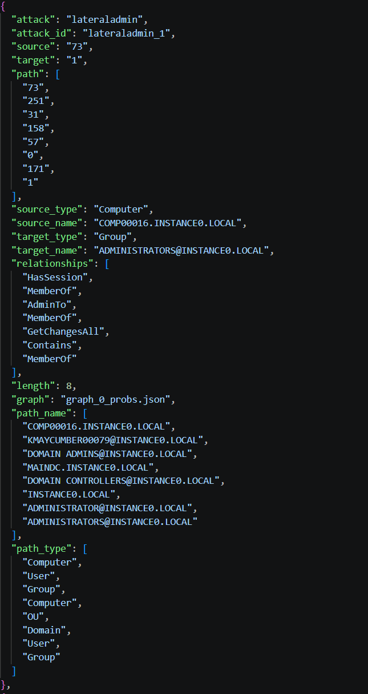

# JSON Format for Attack Simulation Paths

This document explains the structure and meaning of the JSON files generated during attack simulations. Each JSON object represents a single attack path identified in the environment graph. This file is created is the `attack_datasets` folder.

---

## Overview

An attack simulation output is a collection of JSON objects. Each object describes:

- The type of attack performed  
- A unique identifier for the attack instance  
- The source and target nodes  
- The path taken through the graph  
- The relationships used at each step  

---

## Example of an attack dataset
Here is an extract of a shadow admin attack dataset. 

## Field Descriptions

### Core Metadata

- **attack**  
  The name of the attack technique used (e.g., shadowadmin, shortestpath,...).

- **attack_id**  
  A unique identifier for this specific attack path. It is constructed with the concatenation of the attack name and its number.

---

### Source and Target

- **source / target**  
  Internal IDs of the starting and destination nodes.

- **source_type / target_type**  
  Node types (User, Computer, Group, Domain, etc.).

- **source_name / target_name**  
  The label of the nodes as they are written in the AD graph.

---

### Path Definition

- **path**  
  Ordered list of node IDs from source to target.

- **length**  
  Number of nodes in the path.

- **relationships**  
  It is the path the attack has taken in terms of relationships.

- **path_name**  
   Ordered list of node names (labels) from source to target.

- **path_type**  
  Ordered list of node types from source to target.

---

### Graph Reference

- **graph**  
  Name of the AD graph file used to launch the attack.

---

## Consistency Rules

- len(path) == len(path_name) == len(path_type)  
- len(relationships) == len(path) - 1  
- Ordering must match across all arrays  

